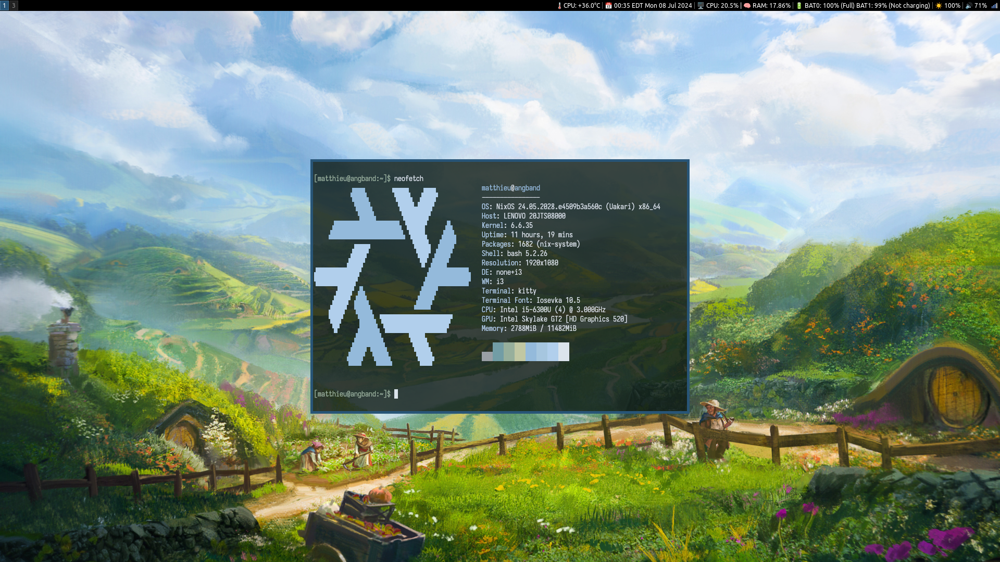
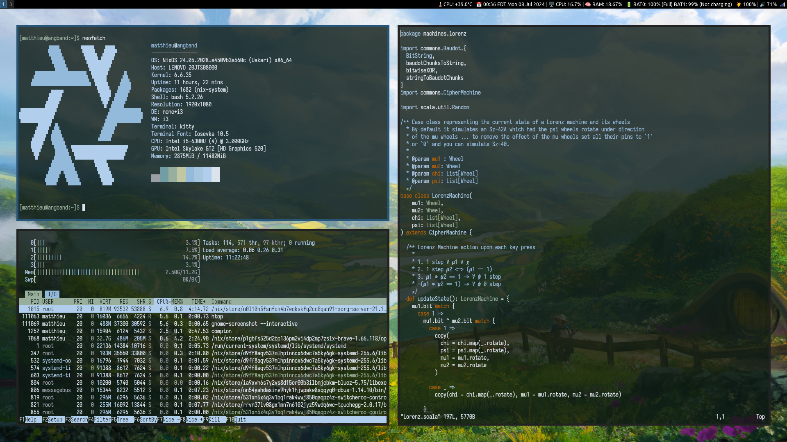

# dotfiles
Repo for the dotfiles and configs I use.




# tools
```
application launcher    — rofi
terminal emulator       — kitty 
compositor              — compton
colour-scheme generator — pywal
window manager          — i3
status bar              — i3blocks
shell                   — bash
text editor             — vim / emacs
terminal multiplexer    — tmux
file manger             — vifm
document viewer         — zathura
notification daemon     — dunst
music player            — cmus/ncspot
```
