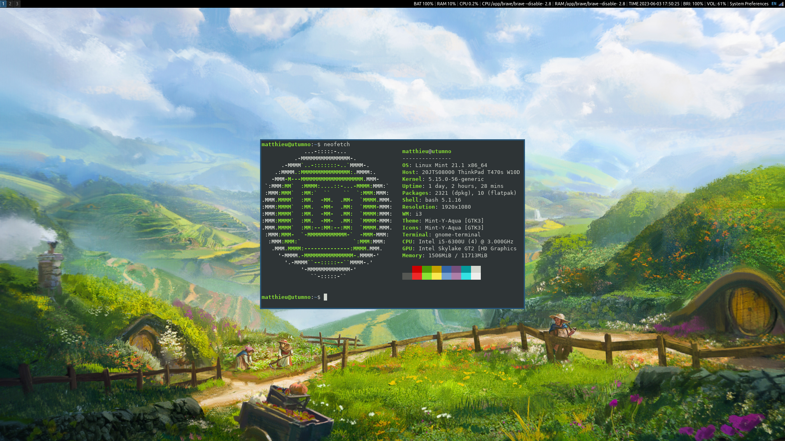
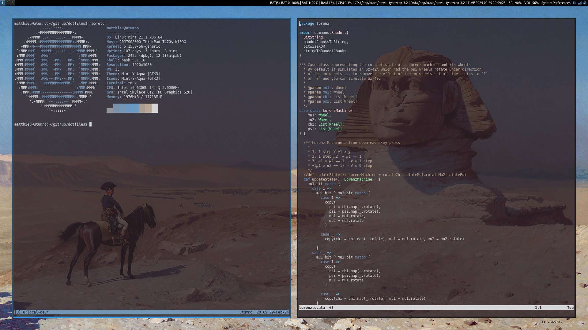

# dotfiles
Repo for the dotfiles and setup scripts I use.




# tools
```
application launcher    — rofi
terminal emulator       — kitty 
compositor              — compton
colour-scheme generator — pywal
window manager          — i3
status bar              — i3blocks
shell                   — bash
text editor             — vim
terminal multiplexer    — tmux
file manger             — vifm
document viewer         — zathura
notification daemon     — dunst
music player            — cmus/ncspot
```

# spring cleaning
```shell
~/Desktop > tree
.
├── Marengo.jpg
├── Jena.docx
├── Austerlitz.mp3
├── Arcole.dmg
└── Rivoli.mp4

~/Desktop > ./clean.sh
~/Desktop > tree
.
├── Documents
│   └── Jena.docx
├── Images
│   └── Marengo.jpg
├── Misc
│   └── Arcole.dmg
├── Music
│   └── Austerlitz.mp3
└── Videos
    └── Rivoli.mp4
```
